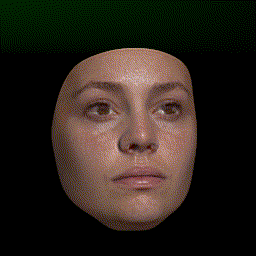
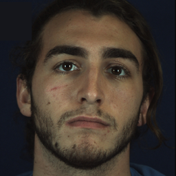
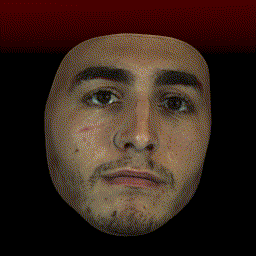
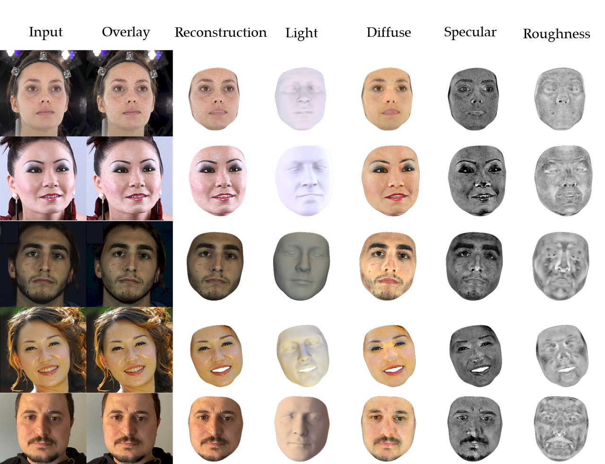
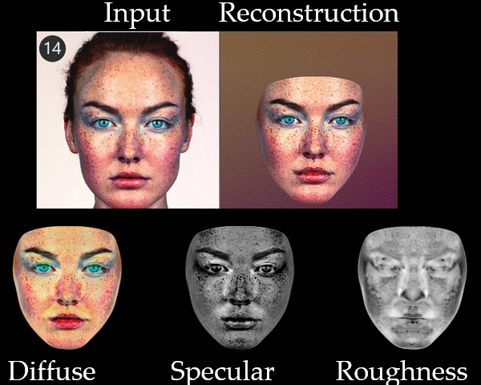

# NextFace
NextFace is a light-weight pytorch library for high-fidelity 3D face reconstruction from monocular image(s) where scene attributes –3D geometry, reflectance (diffuse, specular and roughness), pose, camera parameters, and scene illumination– are estimated. It is a first-order optimization method that uses pytorch autograd engine and ray tracing to fit a statistical morphable model to an input image(s).
<p align="center">
</p>

<p align="center">
<strong>A demo on youtube from here:</strong>
</p>
<p align="center">
<a href="http://www.youtube.com/watch?v=bPFp0oZ9plg" title="Practical Face Reconstruction via Differentiable Ray Tracing"></a>
</p>


# News 
* **19 March 2023**: fixed a bug in the optimizer where the gradients were not activated for the camera pos (rotation and translation). Also I added a new optimization strategy for the second and third stage which should improve the overall performance. plz pull
* **21 June 2022**: Many thanks for **[Jack Saunders](https://researchportal.bath.ac.uk/en/persons/jack-saunders)** for adding this new feature to NextFace: Added support for [mediapipe](https://google.github.io/mediapipe/solutions/face_mesh.html#overview) as a replacement for FAN landmarks detector. Mediapipe produces much stable and accurate results than FAN . To try mediapipe, you need to pull the new version of the code and install mediapipe ** pip install mediapipe** . Now by default the landmarks detector used is mediapipe, if you want to switch bach to FAN plz edit the **optimConfig.ini** file (set **lamdmarksDetectorType = 'fan'**)
* **01 May 2022**: i you want to generate an animation like the one of the gif files in the readme that rotates the reconstruction on the vertical axis, plz run the replay.py script and give it the path of the pickle file that contains the optimized scene attributes ( located in  checkpoints/stage3_output.pickle). 
* **26 April 2022**: I added export of the estimated light map (as an environment map). this can be useful if you want to render the face with other rendering engines (Unreal, Unity, OpenGL). plz pull the code. U can choose to export the lightmap as png or exr (check optimConfig.ini)
* **25 April 2022**: if you want to generate textures with higher resolutions (1024x1024 or 2048x2048) I have added these two maps here : **https://github.com/abdallahdib/NextFace/releases**. to use these maps, download **uvParametrization.2048.pickle** and **uvParametrization.1024.pickle** and put them inside **baselMorphableModel** directory and change the **textureResolution** in **optimConfig.in** to 1024 or 2048. Also dont forget to pull the latest code. Plz note that with these large uvmaps optimization will require more cpu/gpu memory. 
* **24 April 2022**: added a colab notebook in: **demo.ipynb**. 
* **20 April 2022**: I replaced landmarks association file with a new one which gives better reconstruction, especially on face coutours. Plz pull
* **20 April 2022**: I tried NextFace on a challenging face and surprisingly we still get appealing reconstruction, check below:
<p align="center"></p>

# Features: 
* Reconstructs face at high fidelity from single or multiple RGB images
* Estimates face geometry 
* Estimates detailed face reflectance (diffuse, specular and roughness) 
* Estimates scene light with spherical harmonics
* Estimates head pose and orientation
* Runs on both cpu and cuda-enabled gpu


# Installation
* Clone the repository 
* Execute the commands in 'INSTALL' file. these commands create a new conda environment called faceNext and install required packages. An 'environment.yml' is also provided. The library is tested with torch 1.3.1, torchvision 0.4.2 and cuda toolkit 10.1, but it should also work with recent pytorch versions.   
* Activate the environment: conda activate nextFace
* Download basel face model from [here](https://faces.dmi.unibas.ch/bfm/bfm2017.html), just fill the form and you will receive an instant direct download link into your inbox. Downloaded  **model2017-1_face12_nomouth.h5 file** and put it inside **./baselMorphableModel** directory
* Download the albedo face model **albedoModel2020_face12_albedoPart.h5** from [here](https://github.com/waps101/AlbedoMM/releases/download/v1.0/albedoModel2020_face12_albedoPart.h5) and put it inside **./baselMorphableModel** directory


# How to use

## Reconstruction from a single image
* to reconstruct a face from a single image: run the following command:
	* **python optimizer.py --input *path-to-your-input-image* --output *output-path-where-to-save-results***
## Reconstruction from multiple images (batch reconstruction)
* In case you have multiple images with same resolution, u can run a batch optimization on these images. For this, put all ur images in the same directory and run the following command: 
	 * **python optimizer.py --input *path-to-your-folder-that-contains-all-ur-images* --output *output-path-where-to-save-results***
## Reconstruction from mutliple images for the same person
* if you have multiple images for the same person, put these images in the same folder and run the following command:
	 * **python optimizer.py --sharedIdentity --input *path-to-your-folder-that-contains-all-ur-images* --output *output-path-where-to-save-results***

	the **sharedIdentity** flag tells the optimizer that all images belong to the same person. In such case, the shape identity and face reflectance attributes are shared across all images. This generally produces  better face reflectance and geometry estimation. 
## Configuring NextFace
* The file **optimConfig.ini** allows to control different aspect of NextFace such as:
	* optimization (regularizations, number of iterations...)
	* compute device (run on cpu or gpu)
	* spherical harmonics (number of bands, environment map resolution)
	* ray tracing (number of samples)
* The code is self-documented and easy to follow 

# Output 
The optimization takes 4~5 minutes depending on your gpu performance. The output of the optimization is the following:
* render_{imageIndex}.png: contains from left to right: input image, overlay of the final reconstruction on the input image, the final reconstruction, diffuse, specular and roughness maps projected on the face. 
* diffuseMap_{imageIndex}.png: the estimated diffuse map in uv space
* specularMap_{imageIndex}.png: the estimated specular map in uv space
* roughnessMap_{imageIndex}.png: the estimated roughness map in uv space
* mesh{imageIndex}.obj: an obj file that contains the 3D mesh of the reconstructed face

# How it works 
NextFace reprocudes the optimizatin strategy of our [early work](https://arxiv.org/abs/2101.05356). The optimization is composed of the three stages:
* **stage 1**: or coarse stage, where face expression and head pose are estimated by minimizing the geometric loss between the 2d landmarks and their corresponding face vertices. this produces a good starting point for the next optimization stage
* **stage 2**: the face shape identity/expression,  statistical diffuse and specular albedos, head pose and scene light are estimated by minimizing the photo consistency loss between the ray traced image and the real one.
* **stage 3**: to improve the statistical albedos estimated in the previous stage, the method optimizes, on per-pixel basis, the previously estimated albedos and try to capture more albedo details. Consistency, symmetry and smoothness regularizers (similar to [this work](https://arxiv.org/abs/2101.05356)) are used to avoid overfitting and add robustness against lighting conditions.  
By default,  the method uses 9 order spherical harmonics bands (as in [this work](https://openaccess.thecvf.com/content/ICCV2021/papers/Dib_Towards_High_Fidelity_Monocular_Face_Reconstruction_With_Rich_Reflectance_Using_ICCV_2021_paper.pdf)) to capture scene light. you can modify the number of spherical harmonics bands  in **optimConfig.ini** bands and see the importance of using high number of bands for a better shadows recovery. 

# Good practice for best reconstruction

* To obtain best reconstruction with optimal albedos, ensure that the images are taken in good lighting conditions (no shadows and well lit...).
* In case of single input image, ensure that the face is frontal to reconstructs a complete diffuse/specular/roughness, as the method recover only visible parts of the face. 
* Avoid extreme face expressions as the underlying model may fail to recover them. 
# Limitations 
* The method relies on landmarks to initialize the optimization (Stage 1). In case these landmarks are inaccurate, you may get sub-optimal reconstruction. NextFace uses landmarks from [face_alignment](https://github.com/1adrianb/face-alignment) which are robust against extreme poses however they are not as accurate as they can be. This limitation has been discussed [here](https://openaccess.thecvf.com/content/ICCV2021/papers/Dib_Towards_High_Fidelity_Monocular_Face_Reconstruction_With_Rich_Reflectance_Using_ICCV_2021_paper.pdf) and [here](https://arxiv.org/abs/2101.05356). Using [this landmark detector](https://arxiv.org/abs/2204.02776) from Microsoft seems promising. 
* NextFace is slow and execution speed decreases with the size of the input image. For instance, if you are running an old-gpu (like me), you can decrease the resolution of the input image in the **optimConfig.ini** file by reducing the value of the *maxResolution* parameter. Our [recent work](https://openaccess.thecvf.com/content/ICCV2021/papers/Dib_Towards_High_Fidelity_Monocular_Face_Reconstruction_With_Rich_Reflectance_Using_ICCV_2021_paper.pdf) solves for this and achieve near real-time performance using deep convolutional neural network.
* NextFace cannot capture fine geometry details (wrinkles, pores...). these details may get baked in the final albedos. our recent [work](https://arxiv.org/abs/2203.07732) captures fine scale geometric details. 
* The spherical harmonics can only model lights at infinity, under strong directional shadows, the estimated light may not be accurate as it can be, so residual shadows may appear in the estimated albedos. You can attenuate this by increasing the value of regularizers in the **optimConfig.ini** file, but this trade-off albedo details. 
Below are the values to modify: 
	* for diffuse map: *weightDiffuseSymmetryReg* and *weightDiffuseConsistencyReg*, 
	* for specular map: *weightSpecularSymmetryReg*, *weightSpecularConsistencyReg*
	* for roughness map: *weightRoughnessSymmetryReg* and *weightRoughnessConsistencyReg*
I also provided a configuration file named **optimConfigShadows.ini** which have higher values for these regularizers that u can try.
* Using a single image to estimate face attribute is an ill-posed problem and the estimated reflectance maps(diffuse, specular and roughness) are view/camera dependent. To obtain intrinsic reflectance maps, you have to use multiple images per subject.

# Roadmap
If I have time:
* Expression tracking from video by optimizating head pose and expression on per-frame basis, which is straightforward once you have estimated the intrinsic face parameters(reflectance and geometry). I did not implement it yet simply, because i am running an old gpu (GTX 970M). I may add this feature when I decide to buy an RTX :)
* Add virtual lightstage as proposed in [this](https://arxiv.org/abs/2101.05356) to model high frequency point lights.
* Add support for [FLAME](https://github.com/Rubikplayer/flame-fitting) morphable model. You are welcome if you can help. 
* Add GUI interface for loading images, landmarks edition, run optimization and visualize results.
 
# License
NextFace is available for free, under GPL license, to use for research and educational purposes only. Please check LICENSE file.

# Acknowledgements
The uvmap is taken from [here](https://github.com/unibas-gravis/parametric-face-image-generator/blob/master/data/regions/face12.json), landmarks association  from [here](https://github.com/kimoktm/Face2face/blob/master/data/custom_mapping.txt). [redner](https://github.com/BachiLi/redner/) is used for ray tracing, albedo model from [here](https://github.com/waps101/AlbedoMM/).

# contact 
mail: deeb.abdallah @at gmail

twitter: abdallah_dib

# Citation 
If you use NextFace and find it useful in your work, these works are relevant for you:

```
@inproceedings{dib2021practical,
  title={Practical face reconstruction via differentiable ray tracing},
  author={Dib, Abdallah and Bharaj, Gaurav and Ahn, Junghyun and Th{\'e}bault, C{\'e}dric and Gosselin, Philippe and Romeo, Marco and Chevallier, Louis},
  booktitle={Computer Graphics Forum},
  volume={40},
  number={2},
  pages={153--164},
  year={2021},
  organization={Wiley Online Library}
}

@inproceedings{dib2021towards,
  title={Towards High Fidelity Monocular Face Reconstruction with Rich Reflectance using Self-supervised Learning and Ray Tracing},
  author={Dib, Abdallah and Thebault, Cedric and Ahn, Junghyun and Gosselin, Philippe-Henri and Theobalt, Christian and Chevallier, Louis},
  booktitle={Proceedings of the IEEE/CVF International Conference on Computer Vision},
  pages={12819--12829},
  year={2021}
}

@article{dib2022s2f2,
  title={S2F2: Self-Supervised High Fidelity Face Reconstruction from Monocular Image},
  author={Dib, Abdallah and Ahn, Junghyun and Thebault, Cedric and Gosselin, Philippe-Henri and Chevallier, Louis},
  journal={arXiv preprint arXiv:2203.07732},
  year={2022}
}
